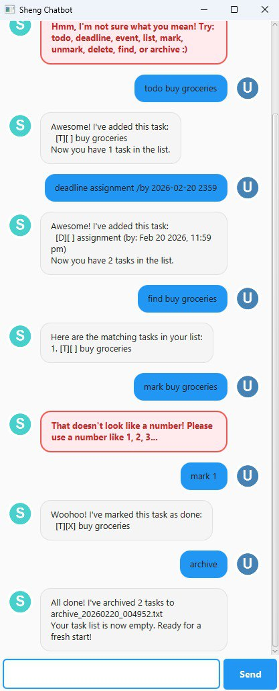

# Sheng User Guide

Sheng is a **friendly task management chatbot** that helps you keep track of your todos, deadlines, and events through a simple chat interface. It features a graphical user interface (GUI) that makes task management quick and enjoyable!



## Quick Start

1. Ensure you have Java 17 or above installed on your computer.
2. Download the latest `sheng.jar` from the releases page.
3. Double-click the file to start the application, or run it from terminal with `java -jar sheng.jar`.
4. Type commands in the text box at the bottom and press Enter or click Send.
5. Start managing your tasks with the commands below!

## Features

> **Notes about the command format:**
> * Words in `UPPER_CASE` are parameters to be supplied by you.
>   e.g., in `todo DESCRIPTION`, `DESCRIPTION` is a parameter which can be used as `todo read book`.
> * Date and time format: `YYYY-MM-DD HHmm` (e.g., `2026-12-31 2359`)

### Adding a todo task: `todo`

Adds a simple task without any date/time.

**Format:** `todo DESCRIPTION`

**Example:**
```
todo read book
```

**Expected output:**
```
Awesome! I've added this task:
  [T][ ] read book
Now you have 1 task in the list.
```

---

### Adding a deadline: `deadline`

Adds a task that needs to be done before a specific date and time.

**Format:** `deadline DESCRIPTION /by DATE_TIME`

**Example:**
```
deadline submit assignment /by 2026-03-15 2359
```

**Expected output:**
```
Awesome! I've added this task:
  [D][ ] submit assignment (by: Mar 15 2026, 11:59 PM)
Now you have 2 tasks in the list.
```

---

### Adding an event: `event`

Adds a task that starts and ends at specific times.

**Format:** `event DESCRIPTION /from START_TIME /to END_TIME`

**Example:**
```
event team meeting /from 2026-03-10 1400 /to 2026-03-10 1600
```

**Expected output:**
```
Awesome! I've added this task:
  [E][ ] team meeting (from: Mar 10 2026, 02:00 PM to: Mar 10 2026, 04:00 PM)
Now you have 3 tasks in the list.
```

---

### Listing all tasks: `list`

Shows all tasks in your list.

**Format:** `list`

**Expected output:**
```
Here are the tasks in your list:
1. [T][ ] read book
2. [D][ ] submit assignment (by: Mar 15 2026, 11:59 PM)
3. [E][ ] team meeting (from: Mar 10 2026, 02:00 PM to: Mar 10 2026, 04:00 PM)
```

---

### Marking a task as done: `mark`

Marks a task as completed.

**Format:** `mark INDEX`

**Example:**
```
mark 1
```

**Expected output:**
```
Woohoo! I've marked this task as done:
  [T][X] read book
```

---

### Unmarking a task: `unmark`

Marks a completed task as not done yet.

**Format:** `unmark INDEX`

**Example:**
```
unmark 1
```

**Expected output:**
```
No worries! I've marked this task as not done yet:
  [T][ ] read book
```

---

### Deleting a task: `delete`

Removes a task from your list permanently.

**Format:** `delete INDEX`

**Example:**
```
delete 2
```

**Expected output:**
```
Noted. I've removed this task:
  [D][ ] submit assignment (by: Mar 15 2026, 11:59 PM)
Now you have 2 tasks in the list.
```

---

### Finding tasks: `find`

Finds all tasks containing the given keyword.

**Format:** `find KEYWORD`

**Example:**
```
find book
```

**Expected output:**
```
Here are the matching tasks in your list:
1. [T][ ] read book
```

---

### Archiving all tasks: `archive`

Saves all current tasks to a timestamped archive file and clears your task list, giving you a fresh start while keeping a backup.

**Format:** `archive`

**Example:**
```
archive
```

**Expected output:**
```
All done! I've archived 3 tasks to archive_20260220_140530.txt
Your task list is now empty. Ready for a fresh start!
```

> **Note:** Archive files are saved in the `data` folder with the format `archive_YYYYMMDD_HHMMSS.txt`

---

### Exiting the program: `bye`

Closes the application and saves your tasks automatically.

**Format:** `bye`

**Expected output:**
```
Bye! Hope to see you again soon! Have a great day!
```

---

## Command Summary

| Command | Format | Example |
|---------|--------|---------|
| **Todo** | `todo DESCRIPTION` | `todo read book` |
| **Deadline** | `deadline DESCRIPTION /by DATE_TIME` | `deadline return book /by 2026-03-15 1800` |
| **Event** | `event DESCRIPTION /from START /to END` | `event project meeting /from 2026-03-10 1400 /to 2026-03-10 1600` |
| **List** | `list` | `list` |
| **Mark** | `mark INDEX` | `mark 2` |
| **Unmark** | `unmark INDEX` | `unmark 2` |
| **Delete** | `delete INDEX` | `delete 3` |
| **Find** | `find KEYWORD` | `find book` |
| **Archive** | `archive` | `archive` |
| **Exit** | `bye` | `bye` |

---

## FAQ

**Q: How do I transfer my data to another computer?**  
A: Copy the `data` folder from your current computer to the same location where you place `sheng.jar` on the new computer.

**Q: What happens if I try to add a duplicate task?**  
A: Sheng will detect duplicates and notify you. For todos, duplicates are tasks with the same description. For deadlines and events, both description and date/time must match.

**Q: Can I edit a task after adding it?**  
A: Currently, you need to delete the task and add it again with the correct details.

**Q: Where are my tasks saved?**  
A: Tasks are automatically saved to `data/sheng.txt` after every change. Archive files are saved in the same `data` folder.

**Q: The application won't start. What should I do?**  
A: Make sure you have Java 17 or higher installed. Check by running `java -version` in your terminal.